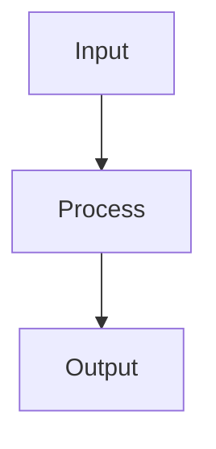

# doc-project — Guia Completo

## Quando usar

Carregue esta skill quando o usuário pedir:
- `/doc-project`, documentar projeto, gerar docs, criar README
- rich readme, readme completo, documentação profissional
- generate documentation, project docs, add docs

---

## PASSO 0 — Identificar o projeto alvo

Se `$ARGUMENTS` contiver um path, usar esse diretório.
Caso contrário, usar o CWD da sessão atual.

```bash
ls -la <project-dir>
```

Verificar se README.md já existe — **ler antes de qualquer escrita**.

---

## PASSO 1 — Análise do Projeto

Executar em paralelo:

```bash
# Estrutura
find <project-dir> -maxdepth 2 -not -path '*/.git/*' -not -path '*/node_modules/*' | head -80

# Manifesto
cat <project-dir>/package.json 2>/dev/null || \
cat <project-dir>/pyproject.toml 2>/dev/null || \
cat <project-dir>/go.mod 2>/dev/null || \
cat <project-dir>/Cargo.toml 2>/dev/null || \
cat <project-dir>/pom.xml 2>/dev/null
```

Ler adicionalmente:
- README.md existente (preservar todas as informações)
- Entry point principal (main.go / index.ts / app.py / src/main.* / cmd/)
- 2–3 arquivos de código mais representativos

**Inferir e documentar:**
- Nome e descrição do projeto
- Stack tecnológica (linguagem, framework, infra)
- Tipo: CLI / API / library / service / platform / SaaS / tooling
- Público-alvo: developers, ops, end-users, internal
- Casos de uso principais (mínimo 3)
- Features / comandos principais
- Prerequisites de instalação
- Variáveis de ambiente relevantes
- Se tem API/CLI pública → gerar `docs/en/api-reference.md`

---

## PASSO 2 — Criar Assets Placeholder

Verificar se ImageMagick está disponível:

```bash
convert --version || echo "ImageMagick não encontrado — instalar antes de continuar"
```

Criar estrutura de diretórios:

```bash
mkdir -p <project-dir>/docs/assets/screenshots
```

Criar todos os placeholders **antes de escrever qualquer markdown**:

```bash
PROJECT_NAME="<nome-do-projeto>"
PROJECT_DIR="<project-dir>"

# Banner (1983×793) — fundo escuro, texto branco
convert -size 1983x793 xc:#1a1a2e \
  -font DejaVu-Sans-Bold -pointsize 72 -fill '#ffffff' \
  -gravity Center -annotate 0 "${PROJECT_NAME}\n[banner — replace with actual image]" \
  "${PROJECT_DIR}/docs/assets/banner.png"

# Banner dark variant (idêntico ao banner principal — para picture tag)
cp "${PROJECT_DIR}/docs/assets/banner.png" \
   "${PROJECT_DIR}/docs/assets/banner-dark.png"

# Diagrama: flow-overview (1536×1024)
convert -size 1536x1024 xc:#f0f0f0 \
  -font DejaVu-Sans -pointsize 48 -fill '#888888' \
  -gravity Center -annotate 0 "DIAGRAM: flow-overview\n[placeholder — replace with actual diagram]" \
  "${PROJECT_DIR}/docs/assets/flow-overview.png"

# Diagrama: architecture (1536×1024)
convert -size 1536x1024 xc:#f0f0f0 \
  -font DejaVu-Sans -pointsize 48 -fill '#888888' \
  -gravity Center -annotate 0 "DIAGRAM: architecture\n[placeholder — replace with actual diagram]" \
  "${PROJECT_DIR}/docs/assets/architecture.png"

# Diagrama: getting-started (1536×1024)
convert -size 1536x1024 xc:#f0f0f0 \
  -font DejaVu-Sans -pointsize 48 -fill '#888888' \
  -gravity Center -annotate 0 "DIAGRAM: getting-started flow\n[placeholder — replace with actual diagram]" \
  "${PROJECT_DIR}/docs/assets/getting-started-flow.png"

# Demo stub (800×500) — representa GIF de demonstração
convert -size 800x500 xc:#e8e8e8 \
  -font DejaVu-Sans -pointsize 36 -fill '#999999' \
  -gravity Center -annotate 0 "DEMO\n[replace with screen recording / GIF]" \
  "${PROJECT_DIR}/docs/assets/demo.png"

# Screenshots (1280×800) — criar 2 exemplos
for name in "feature-main" "feature-secondary"; do
  convert -size 1280x800 xc:#f8f8f8 \
    -font DejaVu-Sans -pointsize 36 -fill '#aaaaaa' \
    -gravity Center -annotate 0 "SCREENSHOT: ${name}\n[placeholder — replace with actual screenshot]" \
    "${PROJECT_DIR}/docs/assets/screenshots/${name}.png"
done
```

Verificar dimensões após criação:

```bash
file "${PROJECT_DIR}/docs/assets/"*.png "${PROJECT_DIR}/docs/assets/screenshots/"*.png
```

---

## PASSO 3 — Gerar README.md

O README deve ter **400–600 linhas** com as seções a seguir nesta ordem exata.

### Seções obrigatórias do README

```
1. Badges (shields.io: license, CI, versão, linguagem)
2. <picture> banner dark/light
3. Tagline (1 linha)
4. Table of Contents (links para todos H2)
5. What is <project>? (2–3 parágrafos, contexto educacional)
6. What this does, in plain English (3–5 use cases concretos)
7. How it works (diagrama flow-overview + fallback Mermaid)
8. Prerequisites (tabela: tool | version | required)
9. Installation (3–5 passos numerados com code blocks)
10. Quick Start / First 5 Minutes (tutorial hands-on)
11. Features (tabela: feature | description | example)
12. Architecture (diagrama architecture + fallback Mermaid)
13. Comparison Matrix (tabela: capability | this project | alternative1 | alternative2)
14. Roadmap (tabela: feature | status | milestone)
15. Getting Help (links: Discussions, Issues, docs)
16. Security (link para SECURITY.md)
17. Contributing (link para CONTRIBUTING.md)
18. License (MIT ou conforme detectado)
19. --- (separador)
20. ## Português (BR) — versão condensada PT-BR (100–150 linhas)
```

### Padrões de formatação obrigatórios

**Banner com dark/light mode:**
```markdown
<p align="center">
  <picture>
    <source media="(prefers-color-scheme: dark)" srcset="docs/assets/banner-dark.png">
     banner" width="100%" />
  </picture>
</p>
```

**Imagens de diagrama com fallback Mermaid:**
```markdown
<p align="center">
  
</p>

<details>
<summary>Ver diagrama em texto (Mermaid)</summary>



</details>
```

**Badges:**
```markdown
[](LICENSE)
[](...)
[](...)
```

---

## PASSO 4 — Gerar docs/en/

### getting-started.md (~300 linhas)

Seções:
- Operating modes / modes of use (Mermaid flowchart)
- Glossary (tabela: term | definition — mínimo 8 termos)
- Prerequisites (detalhado com versões)
- Installation (passo a passo com output esperado)
- First Session / First 10 Minutes (tutorial numerado)
- Common Workflows (tabela: when | what to run)
- What's Next (links para outros guias)

### architecture.md (~200 linhas)

Seções:
- Overview (parágrafo + diagrama)
- Components (tabela: component | responsibility | tech)
- Data Flow (Mermaid sequence diagram)
- Design Decisions (3–5 decisões com rationale)
- Constraints & Trade-offs

### faq.md (~150 linhas)

Grupos de Q&A:
- Getting Started (3–4 perguntas)
- Usage (5–7 perguntas)
- Configuration (3–4 perguntas)
- Troubleshooting (3–4 perguntas)
- Contributing (2–3 perguntas)
- Still Stuck? (links)

### troubleshooting.md (~200 linhas)

Organizado por domínio:
- Install Problems (3–5 subsections)
- Runtime Problems (3–5 subsections)
- Configuration Problems (3–5 subsections)
- Getting Help (GitHub issue template link)

Cada problema:
- H3 heading estilizado como backtick-wrapped error
- Code blocks com bash commands de diagnóstico
- Explicação da causa + solução

### api-reference.md (~200 linhas) — somente se projeto tem CLI/API

Seções:
- CLI Reference (tabela: command | description | example)
- API Endpoints (tabela: method | path | description | auth)
- Environment Variables (tabela: var | default | description | required)
- Configuration Schema (YAML/JSON exemplo comentado)

---

## PASSO 5 — Gerar docs/pt-br/

Criar tradução fiel de **todos** os arquivos de `docs/en/`:
- `getting-started.md`
- `architecture.md`
- `faq.md`
- `troubleshooting.md`
- `api-reference.md` (se gerado)

Manter: mesma estrutura, mesmas seções, mesmos code blocks (não traduzir código).
Traduzir: textos, títulos, descrições, exemplos de output.

---

## PASSO 6 — Gerar docs/assets/README.md

```markdown
# Visual Assets

Guia para contribuir com assets visuais do projeto.

## Estrutura

docs/assets/
├── banner.png          (1983×793 — hero image)
├── banner-dark.png     (1983×793 — dark mode variant)
├── flow-overview.png   (1536×1024 — high-level flow)
├── architecture.png    (1536×1024 — system architecture)
├── getting-started-flow.png (1536×1024 — onboarding flow)
├── demo.png            (800×500 — demo stub, replace with GIF)
└── screenshots/
    ├── feature-main.png      (1280×800)
    └── feature-secondary.png (1280×800)

## Especificações

| Tipo | Dimensões | Formato | Máx. |
|------|-----------|---------|------|
| Banner | 1983×793 | PNG | 500KB |
| Diagrama | 1536×1024 | PNG | 300KB |
| Screenshot | 1280×800 | PNG | 300KB |
| Demo | 800×500 | GIF/PNG | 2MB |

## Ferramentas Recomendadas

- Diagramas: Excalidraw, draw.io, Mermaid
- Screenshots: Carbon (code), Ray.so, capturas reais
- Banner: Figma, Canva, Adobe Express
- GIF: Kap (macOS), ScreenToGif (Windows), peek (Linux)

## Acessibilidade

Todo `` deve ter `alt` text descritivo.
Evitar texto informativo embutido em imagens.
Considerar contraste para modo dark e light.

## Convenção de nomes

kebab-case, descritivo: `feature-authentication-flow.png`
Nunca: `image1.png`, `screenshot.png`, `untitled.png`
```

---

## PASSO 7 — Gerar arquivos de governança

### CHANGELOG.md

```markdown
# Changelog

All notable changes to this project will be documented in this file.

The format is based on [Keep a Changelog](https://keepachangelog.com/en/1.0.0/),
and this project adheres to [Semantic Versioning](https://semver.org/spec/v2.0.0.html).

## [Unreleased]

## [0.1.0] — YYYY-MM-DD

### Added
- Initial release
- [listar features principais inferidas do projeto]
```

### CONTRIBUTING.md

```markdown
# Contributing

[Descrição breve do projeto e da filosofia de contribuição]

## Development Setup

```bash
# [comandos de setup inferidos do projeto]
```

## Adding Features

1. Fork the repository
2. Create a feature branch: `git checkout -b feat/your-feature`
3. Make your changes
4. Run tests: `[comando de teste inferido]`
5. Commit following [Conventional Commits](https://conventionalcommits.org)
6. Open a pull request

## Commit Style

- Present tense, imperative mood: "add feature" not "added feature"
- Reference issues: `feat(scope): add auth — closes #42`
- No AI attribution in commits

## Pull Request Checklist

- [ ] Tests pass
- [ ] Docs updated (EN + PT-BR if applicable)
- [ ] No breaking changes without migration guide
- [ ] Changelog entry added

## Code of Conduct

Be kind, be constructive, be inclusive.
```

### SECURITY.md

```markdown
# Security Policy

## Supported Versions

| Version | Supported |
|---------|-----------|
| latest  | ✅ |

## Reporting a Vulnerability

If you discover a security vulnerability, please **do not** open a public GitHub issue.

Instead, email: [<maintainer-email>] with:
- Description of the vulnerability
- Steps to reproduce
- Potential impact
- Suggested fix (optional)

We will respond within 72 hours and keep you updated throughout the fix process.

## Disclosure Policy

We follow responsible disclosure. Public disclosure happens after a fix is released.
```

### .github/ISSUE_TEMPLATE/bug_report.md

```markdown
---
name: Bug report
about: Create a report to help us improve
title: '[BUG] '
labels: bug
assignees: ''
---

**Describe the bug**
A clear and concise description of what the bug is.

**To Reproduce**
Steps to reproduce the behavior:
1. ...

**Expected behavior**
What you expected to happen.

**Environment**
- OS: [e.g. Ubuntu 22.04]
- Version: [e.g. 0.1.0]
- [other relevant details]

**Additional context**
```

### .github/ISSUE_TEMPLATE/feature_request.md

```markdown
---
name: Feature request
about: Suggest an idea for this project
title: '[FEAT] '
labels: enhancement
assignees: ''
---

**What problem does this solve?**

**Proposed solution**

**Use case**

**Alternatives considered**
```

### .github/pull_request_template.md

```markdown
## What

<!-- What does this PR do? -->

## Why

<!-- Why is this change needed? -->

## How

<!-- How was it implemented? -->

## Validation

- [ ] Tests pass
- [ ] Docs updated (EN + PT-BR)
- [ ] No breaking changes
```

---

## PASSO 8 — Verificação final

```bash
# Dimensões dos PNGs
file <project-dir>/docs/assets/*.png <project-dir>/docs/assets/screenshots/*.png

# Tamanho do README
wc -l <project-dir>/README.md

# Bilinguismo
ls <project-dir>/docs/en/ <project-dir>/docs/pt-br/

# Governança
ls <project-dir>/CHANGELOG.md <project-dir>/CONTRIBUTING.md <project-dir>/SECURITY.md

# Templates GitHub
ls <project-dir>/.github/ISSUE_TEMPLATE/ <project-dir>/.github/pull_request_template.md
```

Checklist de qualidade:
- [ ] README ≥ 400 linhas
- [ ] Badges presentes no topo
- [ ] Banner `<picture>` com dark/light
- [ ] TOC com links âncora para todos os H2
- [ ] Seção "Comparison Matrix" presente
- [ ] Seção "Roadmap" presente
- [ ] Seção "Getting Help" presente
- [ ] Seção "Security" presente
- [ ] Seção PT-BR ao final do README
- [ ] Todos os PNGs existem antes de serem referenciados
- [ ] Fallback Mermaid em `<details>` para cada diagrama
- [ ] docs/en/ e docs/pt-br/ com arquivos espelho
- [ ] CHANGELOG.md, CONTRIBUTING.md, SECURITY.md presentes
- [ ] Templates GitHub presentes

---

## Regras de governança (NUNCA violar)

| Regra | Detalhe |
|-------|---------|
| Nunca referenciar imagem antes de criá-la | PNG deve existir antes de aparecer no markdown |
| Nunca sobrescrever README sem ler | Preservar 100% das informações existentes |
| Bilinguismo obrigatório | docs/pt-br/ sempre espelha docs/en/ |
| Fallback Mermaid obrigatório | Todo diagrama PNG tem `<details>` com Mermaid equivalente |
| Dark/light para banner | Sempre usar `<picture>` tag com variante |
| Dimensões exatas | Banner 1983×793, diagramas 1536×1024, screenshots 1280×800 |
