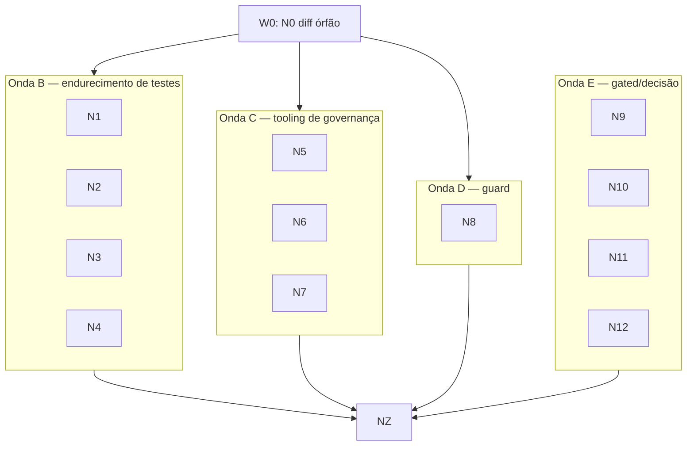

# GOAL-GRAPH — Fechar as ondas pendentes do enterprise-hseos (retomada 2026-10-07)

## Context

A retomada de 2026-10-07 (`_knowledge/projects/enterprise-hseos/CONTINUITY.md`) lista 5 pendências do run `20261006-2040-pendencies-closeout` e 19 herdadas. O owner quer um grafo de loops: o Commander (Opus) orquestra e a execução fica com Sonnet, para fechar o que pode ser fechado.

Decisões do owner nesta sessão:
- **Escopo:** código autônomo + governança. O shard `core` entra com gate humano. Campanhas, T02–T13 e dependências externas ficam como BLOCKED registrado.
- **Diff órfão** de `governance-context.cjs`: adotar como nó W0.
- **Adaptador Claude:** emitir `.claude/settings.json` e `.mcp.json`. `rules/` e `workflows/` não serão emitidos, e isso fica registrado como decisão.
- **Lexer do guard:** incluir o nó de correção.

## Veredito honesto

Teto autônomo realista: cerca de 70% dos itens executáveis chegam a PR verde. Merge, edição do shard `core` e notificação de times são gates humanos, e nenhuma autonomia os fura.

Paredes duras, que ficam fora do grafo:
- campanhas evolutivas (matriz 18→≥30×3, W5–W8, quarta família, W4-07b, G9/A13);
- plano T02–T13, cuja origem não foi localizada;
- Resolv e Fase 6, que pertencem a repositórios consumidores;
- reabertura de sessões MCP, que é operacional e cabe ao owner.

## Gap-map (diamond: 3 leitores Sonnet + confronto Opus)

**Já existe (não reimplementar):**
- `test/helpers/free-port.js` (`freePort`, `spawnOnFreePort`, `stopChild`), já usado em `test-kanban-central.js` e `test-state-ui.js`.
- O validador já rejeita `claude-code authored this` (`test/test-commit-msg.js:261`). O resíduo da #195 está fechado e só falta registrar.
- O emissor de MCP do `goose.js` a partir de `sources.mcpBundles`, que serve de padrão para o adaptador Claude.
- O precedente de excluir um script de CI do pacote: `"!scripts/governance/check-w4-mutations.js"` em `package.json#files`.
- O loader do snapshot ECP já checa o sha256 contra o lock (`tools/cli/lib/capability-registry.js:324-341`).

**Conflita:**
- O limite de inventário 1472 não tem folga, e `scripts/**`, `tools/**` e `.enterprise/**` entram no pacote. Arquivo novo nessas pastas precisa ir para módulo existente ou ganhar uma negação em `files`.
- `.enterprise/**` (policies, `.specs/core`) é âncora. Nenhum nó edita ali sem `ANCHOR_OVERRIDE=1` humano.

**Falta:**
- migração de 3 testes para portas livres;
- robustez do pre-commit (neutralidade usando `git ls-files`; testes ACP com `.codex` ancestral);
- medição de flakiness do `session-track`;
- folga de cobertura;
- job de drift ECP;
- gate política×cluster;
- regra de CODEOWNERS para `shared-infrastructure.md`;
- emissão de `settings.json` e `.mcp.json`;
- correção do lexer;
- standards da ADR-0039.

**Premissas erradas:**
- A "ADR-0008 §2" não define `rules/` e `workflows/`; o que existe é o cabeçalho de `claude-code.js:24-28`.
- O resíduo do validador já estava fechado.
- Os 80,19% de cobertura não aparecem em nenhum arquivo e precisam ser remedidos.
- O snapshot ECP depende de uma tag upstream nova, que pode não existir.

## Nós

| id | mini-goal | escopo (allowed_paths) | verify_step | tier | domínio | tipo |
|---|---|---|---|---|---|---|
| N0 | Adotar o diff do `consumerRoot()` | `.agents/hooks/handlers/governance-context.cjs`, `.enterprise/governance/hooks/handlers/governance-context.cjs` (cópia sincronizada; o `anchor-guard` precisa permitir handler espelhado, senão vira gate humano), `test/test-governance-context.js` | `node test/test-governance-context.js` + diff idêntico entre as 2 cópias | Sonnet | code | estático |
| N1 | Migrar 3 testes para `free-port.js` | `test/test-mcp-agent-state.js`, `test/test-mcp-hseos-governance.js`, `test/test-native-entrypoint-wiring.js` | os 3 testes passam 5× seguidas sob `heavy-run` | Sonnet | code | dinâmico: discovery (o `/health` dos servidores MCP devolve `instance_id`?) → `spawnOnFreePort`, senão `freePort` + `waitFor` |
| N2 | Pre-commit robusto ao host | `test/test-documentation-neutrality.js` (passar a usar `git ls-files`), testes ACP (`test/test-codex-acp-peer.js` e os que chegam a `validateRestrictedDirectories`) | testes passam com `TMPDIR=/build/tmp` (que tem `.codex` ancestral) e com um `.md` untracked contendo termo proibido | Sonnet | code | dinâmico: fan-out pelos testes ACP afetados |
| N3 | Medir e endurecer `session-track` | `test/test-hook-handlers.js` | loop de 20 execuções de `test:hooks`; 0 falhas = só registro, falhou = correção + novo loop | Sonnet | code | loop-until-dry (K=20 limpas, budget 3 rodadas de correção) |
| N4 | Folgas de cobertura e inventário | `test/test-capability-catalog.js`, `test/test-workflow-catalog.js` | `npm run test:contract-coverage` com margem ≥2 pts; `npm pack --dry-run` registra o `entryCount` real | Sonnet | code | estático |
| N5 | Gate política×cluster + CODEOWNERS | `scripts/governance/check-shared-infra-drift.js` (novo, com negação em `package.json#files`), `.github/CODEOWNERS`, teste novo em `test/` com fixture de `kubectl` | teste com fixtures (serviço faltando = fail, réplica divergente = warn); o run live com `kubectl` é opcional e read-only | Sonnet | code (só leitura no cluster) | estático |
| N6 | Job de drift snapshot×ref do ECP | `.github/workflows/ecp-drift.yaml` (agendado, compara o sha256 do lock com o arquivo no `ref` upstream; reaproveita `platform-bindings sync`) | `actionlint`/yaml válido + teste local do comparador | Sonnet | code/CI | estático |
| N7 | Emitir `.claude/settings.json` e `.mcp.json` | `tools/cli/installers/lib/core/agent-core-compiler/adapters/claude-code.js`, testes do compilador, registro de decisão sobre `rules/` e `workflows/` no cabeçalho do adaptador e no CHANGELOG | testes do compilador + fixture: bundle → `allowedMcpServers` e `.mcp.json`; ausência de `rules/` e `workflows/` assertada | Sonnet | code | estático |
| N8 | Corrigir o lexer do guard | `tools/cli/lib/capability-intake-guard.js`, `test/test-capability-intake-guard.js` (`knownAllow` → negados) | os 4 casos conhecidos passam a ser negados; fuzz de 600k lexings + 2400 overrides sem regressão contra a master | Sonnet (executor) + **Opus árbitro** | code/segurança | dinâmico: loop-until-dry de casos de bypass (K=2 rodadas secas, budget 3 ciclos) + adversarial-verify por achado |
| N9 | Avaliar consultas curtas `design.*` | só leitura (`hseos capability resolve sso\|ui\|design\|theme\|tokens`) | relatório com resultados reais + proposta (ex.: heurística só com ≥3 caracteres) | Sonnet | doc | estático → **decisão do owner** |
| N10 | Snapshot ECP com a org nova | `.enterprise/governance/capabilities/*`, `.agents/capabilities/*`, `test/fixtures/ecp-registry/*` | `node test/test-capability-catalog.js` + o lock bate | Sonnet | anchor/contract | dinâmico: só roda se existir tag `contracts-v*` upstream com `HideakiSolutions`; senão BLOCKED |
| N11 | ADR-0039: standards referenciam a ADR + notificar times | `.enterprise/.specs/core/*` (Platform Capability Governance, Engineering Governance, API Mgmt, Docs), checkboxes da ADR-0039 | PR separada com `validate-constitutional-change.js` verde | Sonnet | anchor/core | estático, **gate humano** (`ANCHOR_OVERRIDE` + aprovação da Engineering Leadership; a notificação é do owner) |
| N12 | Recontar as 305 divergências de `canonical_rules` | só leitura em `/workspace/default-workarea/ai-governance/db/ai-governance-rules.db` (via módulo `sqlite3` do Python) | relatório: contagem atual, delta e amostra relevante ao HSEOS | Sonnet | doc | estático → decisão do owner |
| NZ | Closeout | `.hseos/runs/dev-squad/<run>/STATUS.md`, vault (`CONTINUITY`, `state`, `work-log`) | todas as pendências resolvidas listadas; as BLOCKED com causa | Opus (Commander) | doc | barreira final |

## DAG



- **Camada 0:** N0. Limpa o checkout principal; o patch é aplicado num worktree e só depois o checkout é restaurado, com o diff conferido idêntico.
- **Camada 1:** as ondas B, C, D e E rodam em paralelo, porque não têm arquivos em comum entre si. Só N5 mexe em `package.json`.
- **Caminho crítico:** N0 → N8 (loop do lexer + fuzz) → NZ.
- N9, N11 e N12 são leitura ou PR com gate, e podem correr desde o início.

## Gates

| Domínio | Linha |
|---|---|
| Merge de qualquer PR | **humano** (`hseos pr closeout <n> --approved`, branch atualizada com a master) |
| Âncora (`.enterprise/**`: N0 cópia espelhada, N10, N11) | **humano** (`ANCHOR_OVERRIDE=1` dado pelo owner fora do grafo) |
| Shard `core` (N11) | **humano** + aprovação da Engineering Leadership na PR |
| Notificar times (N11) e comunicação externa | **humano** |
| `kubectl` live (N5) | auto, desde que seja só leitura (`get`); qualquer escrita é proibida |
| Decisão de produto (N9, N12) | **humano**; o nó só entrega relatório |
| Commit em branch de nó e PR aberta | auto |

## Execution Protocol

- **Coordenação:** skill `dev-squad` / SWARM, ou seja, Commander e Squad. O Commander é esta sessão Opus: planeja, extrai os handoffs, arbitra o N8 e faz o closeout. O Squad roda em Sonnet, e todo `Agent` declara `model: "sonnet"`. O revisor cético também é Sonnet, isolado e sem o contexto do executor. A exceção é o árbitro do N8, em Opus, com opt-in estratégico registrado aqui porque o nó toca um guard de segurança.
- **Runtime:** o grafo é compilado para `workflow.js` em `.hseos/runs/dev-squad/20261007-<hhmm>-pendencies-waves/`, junto com `GOAL-GRAPH.md` (cópia deste plano) e `STATUS.md`. A execução usa o runtime `Workflow`, com opt-in dado pela §3h do AGENTS e pelo pedido do owner. Fallback: `Agent` em background por nó.
- **Invariantes de governança:**
  - 1 nó = 1 worktree (`scripts/governance/worktree-manager.sh create`) = 1 commit.
  - O `loop-guard` (scope + budget + heartbeat) e o `anchor-guard` rodam em todo nó.
  - Toda entrega passa por revisão cética em duas passagens (cega, depois confronto). O revisor não corrige.
  - No máximo 3 ciclos de correção por nó; depois disso, análise de causa raiz e mudança de estratégia registrada.
  - Nunca converter BLOCKED em PASS, nem afrouxar threshold (cobertura 80/80/70/80, inventário 1472).
  - O arquivo `HSEOS-GOAL-HARNESS-AUTONOMO.md` é preservado e nunca tocado.
  - `git merge --no-ff` via `rtk proxy`.
- **Carga do host (§3f):** `uptime` antes de cada execução pesada. O executor roda só os testes-alvo do nó, sempre via `heavy-run`. A validação completa (`worktree-manager.sh validate`, 6 gates) acontece uma vez por onda, serializada, com Node 24, cgroup delegado e `TMPDIR=/build/hseos-qg-tmp`. No máximo 2 subagentes com build ou teste ao mesmo tempo.
- **Versionamento por onda:** 1 onda = 1 PR (`feature/pendencies-waves-{a..e}`). N8 e N11 têm PR própria. Depois do merge, tag `pendencies-waves-<onda>` e atualização do CHANGELOG.

| Onda | Nós | PR | Tier |
|---|---|---|---|
| A | N0 | própria | Sonnet |
| B | N1–N4 | 1 PR | Sonnet |
| C | N5–N7 | 1 PR | Sonnet |
| D | N8 | própria | Sonnet + árbitro Opus |
| E | N9, N12 (relatórios); N10 (condicional); N11 (PR do core) | N10 e N11 separadas | Sonnet |
| Z | NZ | — | Opus |

## Registro BLOCKED (fora do grafo, com causa)

- Matriz evolutiva, W5–W8, quarta família, G9/A13 e W4-07b: exigem binding, escopo e orçamento autorizados por campanha.
- T02–T13: plano de origem não localizado no repositório nem no vault.
- Resolv e Fase 6: ownership dos repositórios consumidores.
- Reabrir sessões MCP: ação operacional do owner.
- Avaliação do Axon: tarefa própria, como já registrado.

## Verificação end-to-end

1. Por nó: o `verify_step` da tabela + revisão cética. Espera-se pelo menos 1 REPROVADO em algum nó, como prova de que o verificador tem dentes.
2. Por onda: `worktree-manager.sh validate` (6 gates) verde no ambiente canônico, depois `npm pack --dry-run` com `entryCount` ≤ 1472.
3. Global: `npm test` completo uma única vez no fim (via `heavy-run`); `test:contract-coverage` com margem ≥2 pts; CI verde nas PRs; CONTINUITY sem as pendências fechadas e com as BLOCKED registradas com causa.

## Declaração

```
GOAL-GRAPH — fechar ondas pendentes enterprise-hseos
Gap-map: existe free-port/validador/emissor goose · conflita inventário 1472 e âncoras · falta 11 nós · assume-errado ADR-0008§2, resíduo do validador, 80,19%
Nós: 14 em 3 camadas · paralelismo: até 12 nós na camada 1 (≤2 com teste pesado simultâneo)
Fluxos dinâmicos: N1 (discovery), N2 (fan-out), N3 (until-dry K=20), N8 (until-dry K=2 + adversarial), N10 (condicional)
Gates humanos: merge, âncora/core, notificação, decisões N9/N12
Runtime: Workflow (workflow.js) com fallback dev-squad
Autoridade para ligar: aprovação deste plano; ANCHOR_OVERRIDE só para N10/N11 (e N0, se o anchor-guard bloquear o espelho)
```
