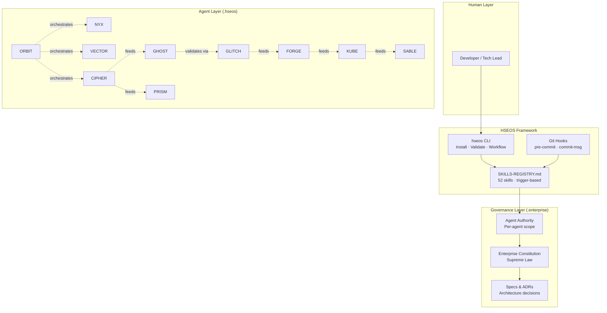
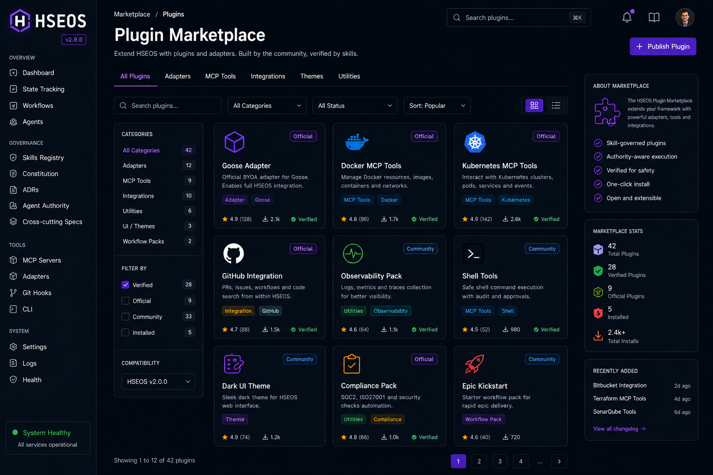
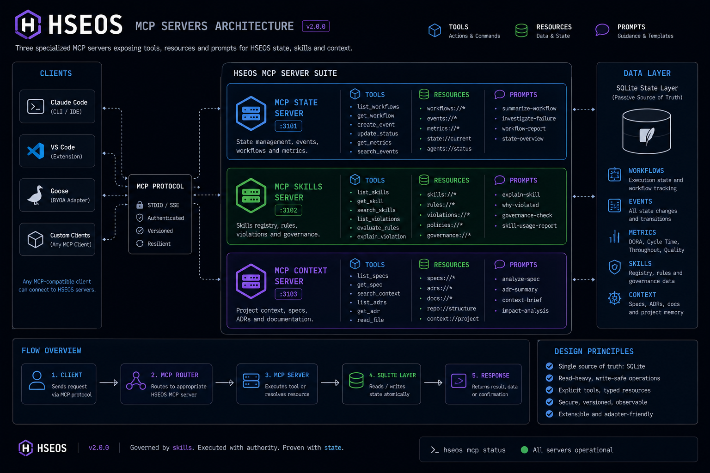

[](LICENSE)
[](https://github.com/marciohideaki/hseos/actions)
[](package.json)
[](https://nodejs.org)
[](.hseos/agents/)
[](.enterprise/governance/agent-skills/)

<p align="center">
  <picture>
    <source media="(prefers-color-scheme: dark)" srcset="docs/assets/banner-dark.png">
    
  </picture>
</p>

> *"Where human intent becomes institutional intelligence."*

**A spec-driven, AI-assisted development framework combining architecture governance, cyberpunk agents, 52 skills, MCPs and engineering workflows.**

---

## Table of Contents

- [What Is HSEOS?](#what-is-hseos)
- [What This Does, in Plain English](#what-this-does-in-plain-english)
- [How It Works](#how-it-works)
- [The Seven Laws](#the-seven-laws)
- [Agent Roster](#agent-roster)
- [Prerequisites](#prerequisites)
- [Installation](#installation)
- [Quick Start](#quick-start)
- [Skills Catalog](#skills-catalog)
- [Architecture](#architecture)
- [Governance Layers](#governance-layers)
- [Comparison Matrix](#comparison-matrix)
- [Roadmap](#roadmap)
- [Getting Help](#getting-help)
- [Security](#security)
- [Contributing](#contributing)
- [License](#license)
- [Português (BR)](#português-br)

---

## What Is HSEOS?

HSEOS is the **Hideaki Software Engineering Operating System** — an institutional framework for engineering teams that want AI agents to accelerate delivery without sacrificing architectural integrity or governance.

It solves a specific problem: most AI coding tools are eager but ungoverned. They write code, make assumptions, and forget context between sessions. HSEOS treats the AI as an **executor** that operates inside an immutable governance layer — constitutional rules, tiered authority boundaries, spec-driven decision gates, and quality hooks that run before every commit.

HSEOS scales from a single developer with a local `npx hseos install` to a multi-team enterprise with dedicated agent squads (NYX, VECTOR, CIPHER, GHOST, RAZOR, ORBIT…) each with explicit, auditable scope.

---

## What This Does, in Plain English

**Scenario 1 — You need to implement a new feature safely:**
Activate `GHOST` (Code Executor). It reads the spec, checks for relevant ADRs, validates DDD boundaries, and commits only after pre-commit quality gates pass. You get auditable, governed code changes.

**Scenario 2 — You need to deploy to production:**
Activate `KUBE` (Kubernetes Delivery Operator). It bumps the image tag in `platform-gitops`, runs Kustomize validation, opens a PR, and waits for ArgoCD sync. No manual manifest editing.

**Scenario 3 — You need to evaluate a technical decision:**
Activate the `/rfc` skill. It loads your current architecture context from the knowledge vault, structures the problem, evaluates 2+ alternatives, and produces a traceable design doc.

**Scenario 4 — You need to document what was just built:**
Activate `QUILL` (Knowledge Scribe) or use `/doc-project`. Full bilingual documentation with placeholder assets, structured guides, and governance templates — generated from the actual codebase.

**Scenario 5 — You need to run a full epic from discovery to deploy:**
Activate `ORBIT` (Flow Conductor). It orchestrates the full delivery pipeline: NYX → VECTOR → CIPHER → GHOST → GLITCH → FORGE → KUBE → SABLE → QUILL.

**Scenario 6 — You have a heterogeneous batch of independent tasks to ship together:**
Activate `SWARM` (Parallel Execution Commander). It plans the batch in Opus, dispatches isolated Sonnet/Haiku subagents in parallel waves under `.worktrees/`, and consolidates 1 commit per task into a single PR.

**Scenario 7 — You need to track active agent runs across sessions:**
HSEOS automatically detects the active run from `.hseos/state/project.db` at session start. The `state-emit-hook.sh` shim queries SQLite for the active `as_runs` entry and wires the session context — no manual env setup required.

**Scenario 8 — You need to verify framework integrity after a change:**
Run `hseos verify` (integrity check), `hseos audit` (spec compliance scan), or `hseos doctor` (full health report). The self-verification suite validates 12 invariants without network calls.

---

## How It Works

<p align="center">
  
</p>

<details>
<summary>Ver diagrama em texto (Mermaid)</summary>


</details>

Each step is governed by skills loaded automatically from the registry. Agents cannot skip constitutional rules, cannot commit without passing quality gates, and cannot take destructive actions without a Human-in-the-Loop gate.

---

## The Seven Laws

1. **Specs are sovereign** — all agents read specs before acting
2. **Ambiguity triggers stop** — no autonomous resolution of conflicts
3. **ADRs are mandatory** for every architectural trade-off
4. **Authority is explicit** — every agent knows exactly what it can and cannot do
5. **GitHub is truth** — chat, memory, and assumption are not authoritative
6. **Enforcement is structural** — governance is not optional
7. **Humans decide** — agents execute

---

## Agent Roster

| Code | Name | Role | Domain |
|------|------|------|--------|
| `NYX` | Intelligence Broker | Business Analysis & Requirements | Discovery |
| `VECTOR` | Mission Architect | Product Vision & PRD Ownership | Planning |
| `CIPHER` | Systems Architect | Technical Design & Architecture | Solutioning |
| `GHOST` | Code Executor | Story Implementation & TDD | Execution |
| `RAZOR` | Sprint Commander | Sprint Planning & Story Preparation | Coordination |
| `GLITCH` | Chaos Engineer | QA, Testing & Risk Discovery | Validation |
| `PRISM` | Interface Weaver | UX Research & Interaction Design | Experience |
| `BLITZ` | Solo Protocol | Full-stack Solo Dev Fast Flow | Autonomy |
| `QUILL` | Knowledge Scribe | Technical Documentation | Knowledge |
| `ORBIT` | Flow Conductor | Multi-agent Delivery Orchestration | Orchestration |
| `FORGE` | Release Engineer | DevOps, CI Artifact Promotion & Publication | DevOps |
| `KUBE` | Kubernetes Delivery Operator | GitOps Manifest Update, PR & ArgoCD Sync | GitOps |
| `SABLE` | Runtime Operator | Rollout Verification & Runtime Smoke | Operations |
| `SWARM` | Parallel Execution Commander | Heterogeneous Batch Decomposition & Worktree-Isolated Fan-Out | Parallelism |
| `ATLAS` | ADO Lifecycle Orchestrator | Azure DevOps Plan→Sync→Close Tracking (feature-flagged via `ado.enabled`) | ADO Ops |

> Plus `HSEOS-MASTER` (`src/core/agents/hseos-master.agent.yaml`) — the meta/bootstrap executor for generic `core`-module tasks, outside the delivery flow.

---

## Prerequisites

| Tool | Version | Required | Notes |
|------|---------|----------|-------|
| Node.js | ≥ 20 | ✅ | Runtime for HSEOS CLI |
| Git | ≥ 2.30 | ✅ | Hooks require modern git |
| Claude Code CLI | latest | ✅ | `npm install -g @anthropic-ai/claude-code` |
| kubectl | ≥ 1.28 | ⚠️ | Required for KUBE agent only |
| ArgoCD CLI | ≥ 2.9 | ⚠️ | Required for GitOps workflows |
| Docker | ≥ 24 | ⚠️ | Required for FORGE agent |

---

## Installation

### 1. Install HSEOS in your project

```bash
npx hseos install
```

This sets up:
- `.claude/commands/` — agent commands as Claude Code slash commands (one file per agent + helpers)
- `.claude/hooks.json` — Claude Code `PreToolUse` / `UserPromptSubmit` hooks (skill suggestion, CLAUDE.md guard, SWARM gate)
- `.codex/config.toml` + `.codex/hseos-hooks.json` — Codex adapter (when `codex` is in `--tools`)
- `.hseos/` — agent configurations, workflow definitions, local config, install manifest
- `.agents/` — vendor-neutral source: `instructions/PROJECT.md`, `skills/<skill>/SKILL.md`, hook + command registries
- `.enterprise/` — governance overlay copied from the HSEOS source (constitution, agent authority, policies, 49-skill governance library). Preserved if you already have one.
- `AGENTS.md` — minimal platform adapter at the project root pointing at `.agents/instructions/PROJECT.md`. Preserved if you already authored one.
- `.git/hooks/pre-commit` — runs `scripts/governance/quality-gates.sh` when present. Skipped when `.git/` is absent or when you pass `--no-git-hooks`. Existing hooks are never overwritten.

### 1b. Pick a capability profile (optional — `developer` is the default)

Installation is driven by an auditable capability catalog (ADR-0016). Profiles: `minimal`,
`developer` (default), `governance`, `gitops`, `ado`, `solo`, `full`. The governance baseline
is always included and cannot be deselected; components with external prerequisites (ADO,
sandbox, telemetry, axon-bridge, second-brain) are optional and degrade gracefully when unmet.

```bash
npx hseos install-plan --list-profiles     # discover profiles
npx hseos install-plan --profile gitops    # dry-run: components, skills, paths, prerequisites
npx hseos install --profile developer      # install a profile
npx hseos install --skills pr-review,rfc   # or baseline + individual skills
```

See [`docs/capabilities.md`](docs/capabilities.md) for the full profile/component/prerequisite reference.

### 2. Select AI tools (optional)

```bash
# Claude Code only (default)
npx hseos install --tools claude-code

# Multiple tools
npx hseos install --tools claude-code,codex,gemini

# Governance files only (no IDE setup)
npx hseos install --tools none
```

Supported tools: `claude-code`, `cursor`, `windsurf`, `gemini`, `codex`, `antigravity`, `github-copilot`, `cline`

### 3. Verify installation

```bash
npx hseos status              # installation status + module versions
npx hseos agent-core verify   # hash-pinned integrity of compiled artifacts
```

`status` reports the installation manifest and installed modules; `agent-core verify` validates every compiled skill/agent against the hashes pinned in `.agents/manifest.yaml`.

---

## Quick Start

### For AI Agents
> Read `CLAUDE.md` first — always.

### For Humans — First Session

```bash
# 1. Read the constitutional entry point
cat CLAUDE.md

# 2. Check available agents
cat AGENTS.md

# 3. Activate an agent (example: solo feature dev)
# In Claude Code: type "BLITZ" or activate via slash command
```

### Engineering Flows

**Standard delivery:**
```
NYX (discover) → VECTOR (plan) → CIPHER (architect) → PRISM (ux)
→ RAZOR (sprint prep) → GHOST (implement) → GLITCH (validate)
→ FORGE (build) → KUBE (deploy) → SABLE (verify) → QUILL (document)
```

**Solo / fast delivery:**
```
BLITZ → FORGE → KUBE → SABLE
```

**Orchestrated epic:**
```bash
# Inspect workflows
hseos workflow list

# Validate readiness before execution
hseos workflow validate <workflow-id> --repo <path> --profile full

# Initialize and advance
hseos workflow init <workflow-id>
hseos workflow advance
```

---

## Skills Catalog

52 skills auto-loaded from the registry based on task context. **You never load skills manually** — agents match triggers and load the minimum tier needed.

| Domain | Skills |
|--------|--------|
| Code Quality | `commit-hygiene`, `sanitize-comments`, `simplicity-first`, `naming-conventions` |
| Architecture | `ddd-boundary-check`, `breaking-change-detection`, `adr-compliance`, `spec-driven` |
| Security | `secure-coding`, `threat-modeling`, `policy-layer` |
| Testing | `test-coverage`, `self-verification`, `verification-before-completion` |
| Observability | `observability-compliance`, `ai-observability` |
| DevOps / GitOps | `gitops-deploy`, `gitops-add-service`, `gitops-new-project` |
| Documentation | `documentation-completeness`, `doc-project` |
| Multi-agent | `multi-agent-orchestration`, `inter-agent-comms`, `dev-squad` |
| Research / Design | `tech-research`, `rfc`, `repo-radar` |
| Session | `session-handoff`, `context-compression`, `context-engineering` |

See full catalog: [`docs/skills.md`](docs/skills.md) · Registry: [`.enterprise/governance/agent-skills/SKILLS-REGISTRY.md`](.enterprise/governance/agent-skills/SKILLS-REGISTRY.md)

---

## Architecture

<p align="center">
  
</p>

<details>
<summary>Ver diagrama em texto (Mermaid)</summary>



</details>

### Repository Structure

```
hseos/
├── .hseos/                         # HSEOS Agent Framework Core
│   ├── agents/                     # 15 agent YAML definitions
│   ├── workflows/                  # Engineering workflow definitions
│   ├── config/                     # Framework configuration
│   └── data/                       # Templates and data files
│
├── .enterprise/                    # Institutional Governance Overlay
│   ├── .specs/constitution/        # Enterprise Constitution (supreme law)
│   ├── .specs/core/                # Org-wide invariants
│   ├── .specs/decisions/           # Architecture Decision Records
│   ├── agents/                     # Agent authority & constraint definitions
│   ├── governance/agent-skills/    # 52 tiered executable skills
│   ├── policies/                   # Operational governance policies
│   └── playbooks/                  # How to operate within governance
│
├── tools/                          # CLI tooling (hseos-cli, workflow runner)
├── src/                            # Core source (hsm, utility modules)
├── test/                           # Agent schema + installation tests
├── docs/                           # Documentation hub
└── CLAUDE.md                       # Master AI entry point
```

---

## Governance Layers

| Layer | Location | Purpose |
|-------|----------|---------|
| Constitution | `.enterprise/.specs/constitution/` | Supreme law — all agents read this first |
| Core Standards | `.enterprise/.specs/core/` | Org-wide invariants (naming, structure) |
| Cross-Cutting | `.enterprise/.specs/cross/` | Security, observability, data governance |
| Stack Standards | `.enterprise/.specs/<Stack>/` | Language/framework specifics |
| ADRs | `.enterprise/.specs/decisions/` | Traceable architectural decisions |
| Agent Authority | `.enterprise/agents/<code>/` | Per-agent scope and hard limits |
| Skills | `.enterprise/governance/agent-skills/` | 52 tiered skills, trigger-loaded |

---

## Comparison Matrix

| Capability | HSEOS | GitHub Copilot | Cursor | Raw Claude Code |
|-----------|-------|---------------|--------|----------------|
| Governance constitution | ✅ immutable | ❌ | ❌ | ❌ |
| Named agent roles | ✅ 15 agents | ❌ | ❌ | ❌ |
| Tiered skill registry | ✅ 52 skills | ❌ | ❌ | ❌ |
| Pre-commit enforcement | ✅ husky hooks | ❌ | ❌ | ❌ |
| ADR tracking | ✅ built-in | ❌ | ❌ | ❌ |
| GitOps deploy workflow | ✅ KUBE agent | ❌ | ❌ | ❌ |
| Multi-agent orchestration | ✅ ORBIT | ❌ | ❌ | partial |
| HITL gates | ✅ structural | ❌ | ❌ | manual |
| Multi-tool support | ✅ 8+ tools | Copilot only | Cursor only | Claude only |
| Context session continuity | ✅ skills | ❌ | partial | partial |
| Solo fast-track mode | ✅ BLITZ | ✅ | ✅ | ✅ |

---

## Roadmap

### What shipped in v2.0.0 (all waves complete)

| Wave | Description | Status |
|---|---|---|
| W0 | Foundation: decouple from global `~/.claude` — standalone install | ✅ |
| W1 | Agent skills + hook registry neutralization — vendor-neutral | ✅ |
| W2 | Compiler v2 modular pipeline (sources / adapters / lib / manifest) | ✅ |
| W3 | 3 native MCP servers (governance :3101, swarm :3102, axon-bridge :3103) | ✅ |
| W4 | Hook handlers implementation — 8 active handlers | ✅ |
| W5 | Plugin marketplace + dual-format emit (`.claude-plugin/` + `.codex-plugin/`) | ✅ |
| W6 | Self-verification suite (verify / audit / doctor — 12 tests) | ✅ |
| W7 | `@hseos/adapter-sdk` + Goose BYOA reference adapter — 37 tests | ✅ |
| W8 | Bilingual docs + CI matrix + migration guide + smithery.yaml | ✅ |
| W9 | Release v2.0.0 — version bump, CHANGELOG, tag | ✅ |

### Post-v2.0 backlog

| Feature | Status | Notes |
|---------|--------|-------|
| `dev-squad` SessionStart env injection (`HSEOS_CURRENT_*` vars) | 📋 Planned | Finding #5 from pós-release audit |
| Visual governance editor | 📋 Planned | Web UI over constitution specs |
| Smithery registry submission | ⛔ Opted out | Private / institutional use only |
| NPM publish `@hseos/*` packages | ⛔ Opted out | Internal use; install via git/path |

---

## Adapter SDK & BYOA

HSEOS ships `@hseos/adapter-sdk` (`packages/adapter-sdk/`) — a minimal base class and utilities for authoring Bring-Your-Own-Adapter (BYOA) integrations.

```javascript
const { AdapterBase } = require('@hseos/adapter-sdk');
class MyAdapter extends AdapterBase {
  static get id() { return 'my-tool'; }
  async emit(sources, outputDir) { /* write platform files */ }
}
module.exports = MyAdapter;
```

Install a third-party adapter via npm (`npm install @hseos/adapter-my-tool`) — the compiler discovers it automatically via `node_modules/@hseos/adapter-*`.

**Reference BYOA adapter:** `tools/cli/.../adapters/goose.js` implements the [Goose](https://github.com/block/goose) (LF AAIF) adapter as the canonical example.

---

## Plugin Marketplace

<p align="center">
  
</p>

HSEOS ships 4 built-in plugins and a dual-format emitter (`.claude-plugin/` + `.codex-plugin/`):

| Plugin | Purpose |
|---|---|
| `hseos-skill-creator` | Scaffold SKILL.md+QUICK.md with HSEOS frontmatter via `/skill-new` |
| `hseos-hookify` | Author hooks in neutral registry format with adapter dispatch |
| `hseos-pr-review` | HSEOS commit-hygiene + PR review (`/pr-review`, `/pr-lint`) |
| `hseos-security-guidance` | Threat modeling + dependency audit skill activations |

```bash
hseos plugin list              # show marketplace catalog
hseos plugin install <id>      # install to .claude-plugin/ + .codex-plugin/
hseos plugin doctor            # conformance check all installed plugins
```

---

## State Tracking

HSEOS ships a lightweight SQLite-backed state layer at `.hseos/state/project.db`. It gives you persistent, cross-session visibility into agent runs without a server or cloud dependency.

```bash
hseos state-emit start --run <run-id>   # open a run
hseos state list                        # list recent runs
hseos state describe <run-id>           # full run detail
hseos kanban                            # ASCII kanban in terminal
```

A web side-car (port `:3200`) serves a real-time kanban board via HTTP + SSE:

```bash
hseos state-ui                           # start kanban server at localhost:3200
hseos state-ui --host 0.0.0.0           # LAN / Tailscale accessible
```

The `state-emit-hook.sh` shim is wired as a Claude Code `SessionStart` hook and auto-detects the active run from SQLite — no `HSEOS_CURRENT_RUN_ID` env required.

See [`docs/state-tracking.md`](docs/state-tracking.md) for the full reference.

---

## Native MCP Servers

<p align="center">
  
</p>

HSEOS ships four native MCP servers, each with dedicated toolsets:

| Server | Port | Description |
|--------|------|-------------|
| `hseos-project-state` | 3100 | Agent run/task/event/handoff state over SQLite (`as_*` schema + FTS5) |
| `hseos-governance` | 3101 | Constitution queries, ADR lookup, spec validation, quality gate status |
| `hseos-swarm` | 3102 | Worktree management, parallel task dispatch, run state coordination |
| `hseos-axon-bridge` | 3103 | Knowledge graph bridge — links HSEOS runs to Axon memory capsules |

Add to your Claude Code MCP config:

```json
{
  "mcpServers": {
    "hseos-governance": {
      "command": "node",
      "args": ["tools/mcp-hseos-governance/index.js"]
    },
    "hseos-swarm": {
      "command": "node",
      "args": ["tools/mcp-hseos-swarm/index.js"]
    }
  }
}
```

---

## Self-Verification

Three commands for framework health:

```bash
hseos agent-core verify   # integrity check — compiled artifacts vs manifest hashes
hseos agent-core audit    # drift scan — warns instead of failing
hseos agent-core doctor   # full health report across the .agents core
hseos pr closeout <num> --approved  # governed PR merge + safe feature branch cleanup
```

Typical output:

```
✓ Skill accessibility integrity
✓ Skill adr-compliance integrity
…
✓ Agent SWARM integrity
✓ verify: all checks passed.
```

---

## Getting Help

- **Getting started:** [`docs/getting-started.md`](docs/getting-started.md) — Day 1 guide
- **Skills reference:** [`docs/skills.md`](docs/skills.md) — full skills catalog
- **Workflows:** [`docs/workflows.md`](docs/workflows.md) — engineering workflows
- **State tracking:** [`docs/state-tracking.md`](docs/state-tracking.md) — SQLite, kanban, MCP
- **Adapter SDK:** [`docs/ADAPTER-GUIDE.md`](docs/ADAPTER-GUIDE.md) — BYOA adapter authoring
- **Migration from v1:** [`docs/MIGRATION-GUIDE-v1-to-v2.md`](docs/MIGRATION-GUIDE-v1-to-v2.md)
- **Troubleshooting:** [`docs/troubleshooting.md`](docs/troubleshooting.md) — FAQ and common errors
- **Issues:** [github.com/marciohideaki/hseos/issues](https://github.com/marciohideaki/hseos/issues)
- **Discussions:** [github.com/marciohideaki/hseos/discussions](https://github.com/marciohideaki/hseos/discussions)

---

## Security

Please report security vulnerabilities responsibly. See [`SECURITY.md`](SECURITY.md) for our disclosure policy.

---

## Contributing

Contributions welcome. See [`CONTRIBUTING.md`](CONTRIBUTING.md) for setup, commit style, PR checklist, and governance requirements.

---

## License

MIT — Hideaki Solutions

---

*HSEOS is institutional software. Built for teams that take engineering seriously.*

---

## Português (BR)

### O que é o HSEOS?

HSEOS é o **Hideaki Software Engineering Operating System** — um framework institucional para times de engenharia que querem usar agentes de IA para acelerar entregas sem abrir mão da integridade arquitetural ou da governança.

O framework resolve um problema específico: ferramentas de IA são ágeis mas desgoverrnadas. O HSEOS trata a IA como um **executor** que opera dentro de uma camada de governança imutável — regras constitucionais, limites de autoridade por tier, gates de decisão baseados em spec, e hooks de qualidade que rodam antes de cada commit.

### O que ele faz, em termos simples

- **Implementar feature com segurança** → Ative `GHOST`. Ele lê a spec, verifica ADRs, valida boundaries DDD e commita apenas após os quality gates passarem.
- **Fazer deploy em produção** → Ative `KUBE`. Ele atualiza o image tag no `platform-gitops`, valida o Kustomize e abre o PR.
- **Avaliar decisão técnica** → Use `/rfc`. Carrega contexto de arquitetura, estrutura o problema, avalia 2+ alternativas e produz design doc rastreável.
- **Documentar o que foi construído** → Use `/doc-project` ou ative `QUILL`. Documentação bilíngue completa gerada a partir do codebase real.
- **Executar epic do discovery ao deploy** → Ative `ORBIT`. Ele orquestra: NYX → VECTOR → CIPHER → GHOST → GLITCH → FORGE → KUBE → SABLE → QUILL.

### Instalação rápida

```bash
npx hseos install                  # instala tudo
npx hseos install --no-git-hooks   # pula o pre-commit hook
```

O instalador cria, por padrão:
- `.claude/commands/` + `.claude/hooks.json` (quando `claude-code` está nos adapters)
- `.codex/config.toml` + `.codex/hseos-hooks.json` (quando `codex` está nos adapters)
- `.hseos/` (config, módulos, manifest de instalação)
- `.agents/` (skills, hooks registry, `instructions/PROJECT.md`)
- `.enterprise/` copiado do HSEOS source (constituição, agentes, policies, 52 skills de governança) — preservado se já existir
- `AGENTS.md` na raiz, stub mínimo apontando para `.agents/instructions/PROJECT.md` — preservado se já existir
- `.git/hooks/pre-commit` invocando `scripts/governance/quality-gates.sh` (silencioso se `.git/` não existir; existing hook nunca é sobrescrito)

### Os Sete Princípios

1. **Specs são soberanas** — todos os agentes leem specs antes de agir
2. **Ambiguidade ativa parada** — nenhuma resolução autônoma de conflitos
3. **ADRs são obrigatórias** para toda trade-off arquitetural
4. **Autoridade é explícita** — cada agente sabe exatamente o que pode e não pode fazer
5. **GitHub é a verdade** — chat, memória e suposição não são autoritativos
6. **Enforcement é estrutural** — governança não é opcional
7. **Humanos decidem** — agentes executam

### Agentes disponíveis

| Código | Nome | Papel |
|--------|------|-------|
| `NYX` | Intelligence Broker | Análise de negócio e requisitos |
| `VECTOR` | Mission Architect | Visão de produto e PRD |
| `CIPHER` | Systems Architect | Design técnico e arquitetura |
| `GHOST` | Code Executor | Implementação de stories com TDD |
| `RAZOR` | Sprint Commander | Planejamento de sprint |
| `GLITCH` | Chaos Engineer | QA, testes e descoberta de riscos |
| `PRISM` | Interface Weaver | UX e design de interação |
| `BLITZ` | Solo Protocol | Fast flow para desenvolvimento solo |
| `QUILL` | Knowledge Scribe | Documentação técnica |
| `ORBIT` | Flow Conductor | Orquestração de entrega multi-agente |
| `FORGE` | Release Engineer | DevOps, CI e publicação de artefatos |
| `KUBE` | Kubernetes Operator | GitOps manifest update, PR e ArgoCD |
| `SABLE` | Runtime Operator | Verificação de rollout e smoke tests |
| `SWARM` | Parallel Execution Commander | Batch heterogêneo paralelo (worktree-isolated) |

### Roadmap v2.0.0 (todas as waves concluídas)

| Wave | Descrição | Status |
|---|---|---|
| W0 | Fundação: desacoplar do `~/.claude` global | ✅ |
| W1 | Agent skills + neutralização do hook registry | ✅ |
| W2 | Compiler v2 pipeline modular | ✅ |
| W3 | 3 servidores MCP nativos HSEOS | ✅ |
| W4 | Implementação dos hook handlers — 8 handlers ativos | ✅ |
| W5 | Plugin marketplace + emissão dual-format | ✅ |
| W6 | Auto-verificação (verify/audit/doctor — 12 testes) | ✅ |
| W7 | `@hseos/adapter-sdk` + adaptador Goose BYOA — 37 testes | ✅ |
| W8 | Docs bilíngues + CI matrix + guia de migração | ✅ |
| W9 | Release v2.0.0 | ✅ |

### State Tracking

O HSEOS inclui uma camada de estado baseada em SQLite em `.hseos/state/project.db`:

```bash
hseos kanban          # Kanban ASCII no terminal
hseos state-ui        # Servidor web com kanban em tempo real (localhost:3200)
hseos verify          # Verificação de integridade
hseos doctor          # Relatório de saúde completo
```

Veja [`docs/state-tracking.md`](docs/state-tracking.md) para a referência completa.

### Adapter SDK & BYOA

O HSEOS inclui `@hseos/adapter-sdk` (`packages/adapter-sdk/`) — uma classe base mínima e utilitários para criar integrações Bring-Your-Own-Adapter (BYOA).

```javascript
const { AdapterBase } = require('@hseos/adapter-sdk');
class MeuAdapter extends AdapterBase {
  static get id() { return 'minha-ferramenta'; }
  async emit(sources, outputDir) { /* escreve arquivos da plataforma */ }
}
module.exports = MeuAdapter;
```

Instale um adapter de terceiros via npm (`npm install @hseos/adapter-minha-ferramenta`) — o compiler o descobre automaticamente via `node_modules/@hseos/adapter-*`.

**Adapter BYOA de referência:** `tools/cli/.../adapters/goose.js` implementa o adaptador [Goose](https://github.com/block/goose) (LF AAIF) como exemplo canônico.

### Plugin Marketplace

O HSEOS inclui 4 plugins nativos e um emissor dual-format (`.claude-plugin/` + `.codex-plugin/`):

| Plugin | Finalidade |
|---|---|
| `hseos-skill-creator` | Gera SKILL.md+QUICK.md com frontmatter HSEOS via `/skill-new` |
| `hseos-hookify` | Cria hooks em formato neutro de registry com dispatch por adapter |
| `hseos-pr-review` | Higiene de commits HSEOS + revisão de PR (`/pr-review`, `/pr-lint`) |
| `hseos-security-guidance` | Ativações de skill para threat modeling + auditoria de dependências |

```bash
hseos plugin list              # exibir catálogo do marketplace
hseos plugin install <id>      # instalar em .claude-plugin/ + .codex-plugin/
hseos plugin doctor            # verificar conformidade dos plugins instalados
```

### Links

- [Guia de início](docs/getting-started.md)
- [Catálogo de skills](docs/skills.md)
- [Workflows de engenharia](docs/workflows.md)
- [Contribuindo](CONTRIBUTING.md)
- [Segurança](SECURITY.md)
