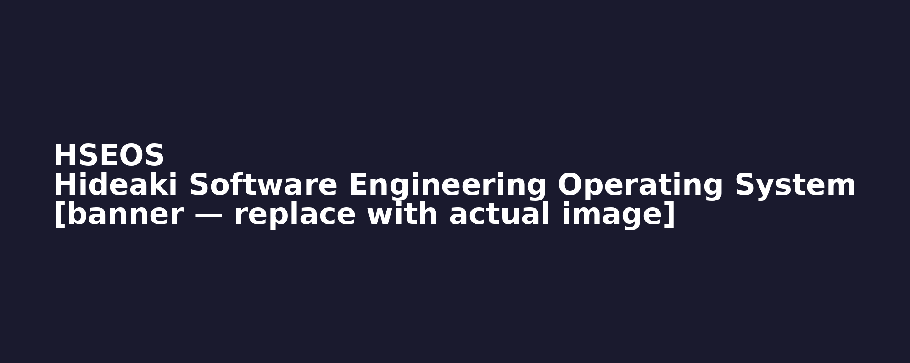
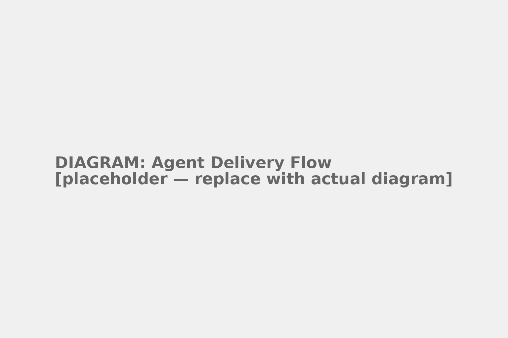
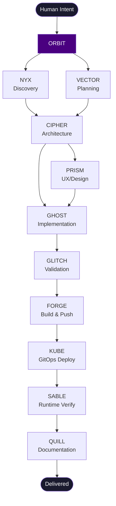
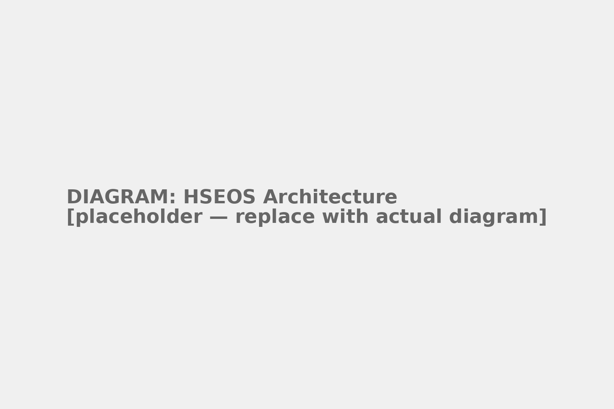

[](LICENSE)
[](https://github.com/marciohideaki/hseos/actions)
[](package.json)
[](https://nodejs.org)
[](.hseos/agents/)
[](.enterprise/governance/agent-skills/)

<p align="center">
  <picture>
    <source media="(prefers-color-scheme: dark)" srcset="docs/assets/banner-dark.png">
    
  </picture>
</p>

> *"Where human intent becomes institutional intelligence."*

**A spec-driven, AI-assisted development framework combining architecture governance, cyberpunk agents, 46 skills, MCPs and engineering workflows.**

---

## Table of Contents

- [What Is HSEOS?](#what-is-hseos)
- [What This Does, in Plain English](#what-this-does-in-plain-english)
- [How It Works](#how-it-works)
- [The Seven Laws](#the-seven-laws)
- [Agent Roster](#agent-roster)
- [Prerequisites](#prerequisites)
- [Installation](#installation)
- [Quick Start](#quick-start)
- [Skills Catalog](#skills-catalog)
- [Architecture](#architecture)
- [Governance Layers](#governance-layers)
- [Comparison Matrix](#comparison-matrix)
- [Roadmap](#roadmap)
- [Getting Help](#getting-help)
- [Security](#security)
- [Contributing](#contributing)
- [License](#license)
- [Português (BR)](#português-br)

---

## What Is HSEOS?

HSEOS is the **Hideaki Software Engineering Operating System** — an institutional framework for engineering teams that want AI agents to accelerate delivery without sacrificing architectural integrity or governance.

It solves a specific problem: most AI coding tools are eager but ungoverned. They write code, make assumptions, and forget context between sessions. HSEOS treats the AI as an **executor** that operates inside an immutable governance layer — constitutional rules, tiered authority boundaries, spec-driven decision gates, and quality hooks that run before every commit.

HSEOS scales from a single developer with a local `npx hseos install` to a multi-team enterprise with dedicated agent squads (NYX, VECTOR, CIPHER, GHOST, RAZOR, ORBIT…) each with explicit, auditable scope.

---

## What This Does, in Plain English

**Scenario 1 — You need to implement a new feature safely:**
Activate `GHOST` (Code Executor). It reads the spec, checks for relevant ADRs, validates DDD boundaries, and commits only after pre-commit quality gates pass. You get auditable, governed code changes.

**Scenario 2 — You need to deploy to production:**
Activate `KUBE` (Kubernetes Delivery Operator). It bumps the image tag in `platform-gitops`, runs Kustomize validation, opens a PR, and waits for ArgoCD sync. No manual manifest editing.

**Scenario 3 — You need to evaluate a technical decision:**
Activate the `/rfc` skill. It loads your current architecture context from the knowledge vault, structures the problem, evaluates 2+ alternatives, and produces a traceable design doc.

**Scenario 4 — You need to document what was just built:**
Activate `QUILL` (Knowledge Scribe) or use `/doc-project`. Full bilingual documentation with placeholder assets, structured guides, and governance templates — generated from the actual codebase.

**Scenario 5 — You need to run a full epic from discovery to deploy:**
Activate `ORBIT` (Flow Conductor). It orchestrates the full delivery pipeline: NYX → VECTOR → CIPHER → GHOST → GLITCH → FORGE → KUBE → SABLE → QUILL.

---

## How It Works

<p align="center">
  
</p>

<details>
<summary>Ver diagrama em texto (Mermaid)</summary>



</details>

Each step is governed by skills loaded automatically from the registry. Agents cannot skip constitutional rules, cannot commit without passing quality gates, and cannot take destructive actions without a Human-in-the-Loop gate.

---

## The Seven Laws

1. **Specs are sovereign** — all agents read specs before acting
2. **Ambiguity triggers stop** — no autonomous resolution of conflicts
3. **ADRs are mandatory** for every architectural trade-off
4. **Authority is explicit** — every agent knows exactly what it can and cannot do
5. **GitHub is truth** — chat, memory, and assumption are not authoritative
6. **Enforcement is structural** — governance is not optional
7. **Humans decide** — agents execute

---

## Agent Roster

| Code | Name | Role | Domain |
|------|------|------|--------|
| `NYX` | Intelligence Broker | Business Analysis & Requirements | Discovery |
| `VECTOR` | Mission Architect | Product Vision & PRD Ownership | Planning |
| `CIPHER` | Systems Architect | Technical Design & Architecture | Solutioning |
| `GHOST` | Code Executor | Story Implementation & TDD | Execution |
| `RAZOR` | Sprint Commander | Sprint Planning & Story Preparation | Coordination |
| `GLITCH` | Chaos Engineer | QA, Testing & Risk Discovery | Validation |
| `PRISM` | Interface Weaver | UX Research & Interaction Design | Experience |
| `BLITZ` | Solo Protocol | Full-stack Solo Dev Fast Flow | Autonomy |
| `QUILL` | Knowledge Scribe | Technical Documentation | Knowledge |
| `ORBIT` | Flow Conductor | Multi-agent Delivery Orchestration | Orchestration |
| `FORGE` | Release Engineer | DevOps, CI Artifact Promotion & Publication | DevOps |
| `KUBE` | Kubernetes Delivery Operator | GitOps Manifest Update, PR & ArgoCD Sync | GitOps |
| `SABLE` | Runtime Operator | Rollout Verification & Runtime Smoke | Operations |

---

## Prerequisites

| Tool | Version | Required | Notes |
|------|---------|----------|-------|
| Node.js | ≥ 18 | ✅ | Runtime for HSEOS CLI |
| Git | ≥ 2.30 | ✅ | Hooks require modern git |
| Claude Code CLI | latest | ✅ | `npm install -g @anthropic-ai/claude-code` |
| kubectl | ≥ 1.28 | ⚠️ | Required for KUBE agent only |
| ArgoCD CLI | ≥ 2.9 | ⚠️ | Required for GitOps workflows |
| Docker | ≥ 24 | ⚠️ | Required for FORGE agent |

---

## Installation

### 1. Install HSEOS in your project

```bash
npx hseos install
```

This sets up:
- `.claude/commands/` — all 13 agent commands as Claude Code slash commands
- `.enterprise/` — governance specs, agent authority files, 46-skill library
- `.hseos/` — agent configurations, workflow definitions, local config
- Git hooks — pre-commit quality gates (lint, schema validation, commit hygiene)

### 2. Select AI tools (optional)

```bash
# Claude Code only (default)
npx hseos install --tools claude-code

# Multiple tools
npx hseos install --tools claude-code,codex,gemini

# Governance files only (no IDE setup)
npx hseos install --tools none
```

Supported tools: `claude-code`, `cursor`, `windsurf`, `gemini`, `codex`, `antigravity`, `github-copilot`, `cline`

### 3. Verify installation

```bash
npx hseos validate
```

Expected output:
```
✅ .enterprise/ governance structure OK
✅ .hseos/agents/ agent definitions OK
✅ git hooks installed
✅ 46 skills registered
```

---

## Quick Start

### For AI Agents
> Read `CLAUDE.md` first — always.

### For Humans — First Session

```bash
# 1. Read the constitutional entry point
cat CLAUDE.md

# 2. Check available agents
cat AGENTS.md

# 3. Activate an agent (example: solo feature dev)
# In Claude Code: type "BLITZ" or activate via slash command
```

### Engineering Flows

**Standard delivery:**
```
NYX (discover) → VECTOR (plan) → CIPHER (architect) → PRISM (ux)
→ RAZOR (sprint prep) → GHOST (implement) → GLITCH (validate)
→ FORGE (build) → KUBE (deploy) → SABLE (verify) → QUILL (document)
```

**Solo / fast delivery:**
```
BLITZ → FORGE → KUBE → SABLE
```

**Orchestrated epic:**
```bash
# Inspect workflows
hseos workflow list

# Validate readiness before execution
hseos workflow validate <workflow-id> --repo <path> --profile full

# Initialize and advance
hseos workflow init <workflow-id>
hseos workflow advance
```

---

## Skills Catalog

46 skills auto-loaded from the registry based on task context. **You never load skills manually** — agents match triggers and load the minimum tier needed.

| Domain | Skills |
|--------|--------|
| Code Quality | `commit-hygiene`, `sanitize-comments`, `simplicity-first`, `naming-conventions` |
| Architecture | `ddd-boundary-check`, `breaking-change-detection`, `adr-compliance`, `spec-driven` |
| Security | `secure-coding`, `threat-modeling`, `policy-layer` |
| Testing | `test-coverage`, `self-verification`, `verification-before-completion` |
| Observability | `observability-compliance`, `ai-observability` |
| DevOps / GitOps | `gitops-deploy`, `gitops-add-service`, `gitops-new-project` |
| Documentation | `documentation-completeness`, `doc-project` |
| Multi-agent | `multi-agent-orchestration`, `inter-agent-comms`, `dev-squad` |
| Research / Design | `tech-research`, `rfc`, `repo-radar` |
| Session | `session-handoff`, `context-compression`, `context-engineering` |

See full catalog: [`docs/skills.md`](docs/skills.md) · Registry: [`.enterprise/governance/agent-skills/SKILLS-REGISTRY.md`](.enterprise/governance/agent-skills/SKILLS-REGISTRY.md)

---

## Architecture

<p align="center">
  
</p>

<details>
<summary>Ver diagrama em texto (Mermaid)</summary>


</details>

### Repository Structure

```
hseos/
├── .hseos/                         # HSEOS Agent Framework Core
│   ├── agents/                     # 13 agent YAML definitions
│   ├── workflows/                  # Engineering workflow definitions
│   ├── config/                     # Framework configuration
│   └── data/                       # Templates and data files
│
├── .enterprise/                    # Institutional Governance Overlay
│   ├── .specs/constitution/        # Enterprise Constitution (supreme law)
│   ├── .specs/core/                # Org-wide invariants
│   ├── .specs/decisions/           # Architecture Decision Records
│   ├── agents/                     # Agent authority & constraint definitions
│   ├── governance/agent-skills/    # 46 tiered executable skills
│   ├── policies/                   # Operational governance policies
│   └── playbooks/                  # How to operate within governance
│
├── tools/                          # CLI tooling (hseos-cli, workflow runner)
├── src/                            # Core source (hsm, utility modules)
├── test/                           # Agent schema + installation tests
├── docs/                           # Documentation hub
└── CLAUDE.md                       # Master AI entry point
```

---

## Governance Layers

| Layer | Location | Purpose |
|-------|----------|---------|
| Constitution | `.enterprise/.specs/constitution/` | Supreme law — all agents read this first |
| Core Standards | `.enterprise/.specs/core/` | Org-wide invariants (naming, structure) |
| Cross-Cutting | `.enterprise/.specs/cross/` | Security, observability, data governance |
| Stack Standards | `.enterprise/.specs/<Stack>/` | Language/framework specifics |
| ADRs | `.enterprise/.specs/decisions/` | Traceable architectural decisions |
| Agent Authority | `.enterprise/agents/<code>/` | Per-agent scope and hard limits |
| Skills | `.enterprise/governance/agent-skills/` | 46 tiered skills, trigger-loaded |

---

## Comparison Matrix

| Capability | HSEOS | GitHub Copilot | Cursor | Raw Claude Code |
|-----------|-------|---------------|--------|----------------|
| Governance constitution | ✅ immutable | ❌ | ❌ | ❌ |
| Named agent roles | ✅ 13 agents | ❌ | ❌ | ❌ |
| Tiered skill registry | ✅ 46 skills | ❌ | ❌ | ❌ |
| Pre-commit enforcement | ✅ husky hooks | ❌ | ❌ | ❌ |
| ADR tracking | ✅ built-in | ❌ | ❌ | ❌ |
| GitOps deploy workflow | ✅ KUBE agent | ❌ | ❌ | ❌ |
| Multi-agent orchestration | ✅ ORBIT | ❌ | ❌ | partial |
| HITL gates | ✅ structural | ❌ | ❌ | manual |
| Multi-tool support | ✅ 8+ tools | Copilot only | Cursor only | Claude only |
| Context session continuity | ✅ skills | ❌ | partial | partial |
| Solo fast-track mode | ✅ BLITZ | ✅ | ✅ | ✅ |

---

## Roadmap

| Feature | Status | Milestone |
|---------|--------|-----------|
| 13 core agents (NYX→SABLE) | ✅ Done | v1.0 |
| 46 skills registry | ✅ Done | v1.1 |
| `hseos install` CLI | ✅ Done | v1.0 |
| Workflow validate/advance CLI | ✅ Done | v1.1 |
| SWARM multi-agent parallelism | ✅ Done | v1.1 |
| Multi-tool install (8 tools) | ✅ Done | v1.1 |
| Web dashboard (usage + runs) | 🔄 In progress | v1.2 |
| Skills auto-sync to `~/.claude/skills/` | 🔄 In progress | v1.2 |
| MCP factory integration | 🔄 In progress | v1.2 |
| GitHub Actions native workflow | 📋 Planned | v1.3 |
| Visual governance editor | 📋 Planned | v1.4 |

---

## Getting Help

- **Docs:** [`docs/getting-started.md`](docs/getting-started.md) — Day 1 guide
- **Skills reference:** [`docs/skills.md`](docs/skills.md) — full skills catalog
- **Workflows:** [`docs/workflows.md`](docs/workflows.md) — engineering workflows
- **Issues:** [github.com/marciohideaki/hseos/issues](https://github.com/marciohideaki/hseos/issues)
- **Discussions:** [github.com/marciohideaki/hseos/discussions](https://github.com/marciohideaki/hseos/discussions)

---

## Security

Please report security vulnerabilities responsibly. See [`SECURITY.md`](SECURITY.md) for our disclosure policy.

---

## Contributing

Contributions welcome. See [`CONTRIBUTING.md`](CONTRIBUTING.md) for setup, commit style, PR checklist, and governance requirements.

---

## License

MIT — Hideaki Solutions

---

*HSEOS is institutional software. Built for teams that take engineering seriously.*

---

## Português (BR)

### O que é o HSEOS?

HSEOS é o **Hideaki Software Engineering Operating System** — um framework institucional para times de engenharia que querem usar agentes de IA para acelerar entregas sem abrir mão da integridade arquitetural ou da governança.

O framework resolve um problema específico: ferramentas de IA são ágeis mas desgoverrnadas. O HSEOS trata a IA como um **executor** que opera dentro de uma camada de governança imutável — regras constitucionais, limites de autoridade por tier, gates de decisão baseados em spec, e hooks de qualidade que rodam antes de cada commit.

### O que ele faz, em termos simples

- **Implementar feature com segurança** → Ative `GHOST`. Ele lê a spec, verifica ADRs, valida boundaries DDD e commita apenas após os quality gates passarem.
- **Fazer deploy em produção** → Ative `KUBE`. Ele atualiza o image tag no `platform-gitops`, valida o Kustomize e abre o PR.
- **Avaliar decisão técnica** → Use `/rfc`. Carrega contexto de arquitetura, estrutura o problema, avalia 2+ alternativas e produz design doc rastreável.
- **Documentar o que foi construído** → Use `/doc-project` ou ative `QUILL`. Documentação bilíngue completa gerada a partir do codebase real.
- **Executar epic do discovery ao deploy** → Ative `ORBIT`. Ele orquestra: NYX → VECTOR → CIPHER → GHOST → GLITCH → FORGE → KUBE → SABLE → QUILL.

### Instalação rápida

```bash
npx hseos install
```

### Os Sete Princípios

1. **Specs são soberanas** — todos os agentes leem specs antes de agir
2. **Ambiguidade ativa parada** — nenhuma resolução autônoma de conflitos
3. **ADRs são obrigatórias** para toda trade-off arquitetural
4. **Autoridade é explícita** — cada agente sabe exatamente o que pode e não pode fazer
5. **GitHub é a verdade** — chat, memória e suposição não são autoritativos
6. **Enforcement é estrutural** — governança não é opcional
7. **Humanos decidem** — agentes executam

### Agentes disponíveis

| Código | Nome | Papel |
|--------|------|-------|
| `NYX` | Intelligence Broker | Análise de negócio e requisitos |
| `VECTOR` | Mission Architect | Visão de produto e PRD |
| `CIPHER` | Systems Architect | Design técnico e arquitetura |
| `GHOST` | Code Executor | Implementação de stories com TDD |
| `RAZOR` | Sprint Commander | Planejamento de sprint |
| `GLITCH` | Chaos Engineer | QA, testes e descoberta de riscos |
| `PRISM` | Interface Weaver | UX e design de interação |
| `BLITZ` | Solo Protocol | Fast flow para desenvolvimento solo |
| `QUILL` | Knowledge Scribe | Documentação técnica |
| `ORBIT` | Flow Conductor | Orquestração de entrega multi-agente |
| `FORGE` | Release Engineer | DevOps, CI e publicação de artefatos |
| `KUBE` | Kubernetes Operator | GitOps manifest update, PR e ArgoCD |
| `SABLE` | Runtime Operator | Verificação de rollout e smoke tests |

### Links

- [Guia de início](docs/getting-started.md)
- [Catálogo de skills](docs/skills.md)
- [Workflows de engenharia](docs/workflows.md)
- [Contribuindo](CONTRIBUTING.md)
- [Segurança](SECURITY.md)
