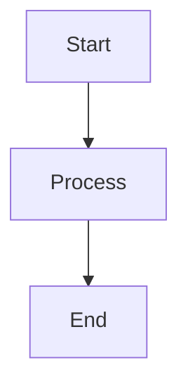

# Visual Assets

Guide for contributing visual assets to HSEOS documentation.

---

## Current Asset Inventory (v2.0.0)

| File | Dimensions | Size | Status | Used in |
|------|-----------|------|--------|---------|
| `banner.png` | 1983×793 | 1.2 MB | ✅ final | README.md (light mode hero) |
| `banner-dark.png` | 1983×793 | 1.4 MB | ✅ final | README.md (dark mode hero) |
| `flow-overview.png` | 1536×1024 | 1.5 MB | ✅ final | README.md §How It Works |
| `architecture.png` | 1536×1024 | 1.6 MB | ✅ final | README.md §Architecture |
| `getting-started-flow.png` | 1536×1024 | 1.6 MB | ✅ final | docs/getting-started.md |
| `mcp-servers.png` | 1536×1024 | 1.6 MB | ✅ final | README.md §Native MCP Servers |
| `plugin-marketplace.png` | 1536×1024 | 1.6 MB | ✅ final | README.md §Plugin Marketplace |
| `adapter-sdk-flow.png` | 1536×1024 | 1.6 MB | ✅ final | docs/ADAPTER-GUIDE.md |
| `swarm-worktree.png` | 1536×1024 | 1.6 MB | ✅ final | docs/agents/swarm.md |
| `screenshots/agent-activation.png` | 1536×1024 | 1.6 MB | ✅ final ⚠️ dims | docs/README.md §How Agents are Activated |
| `screenshots/skills-registry.png` | 1280×800 | 17 KB | ⚠️ placeholder | docs/skills.md |
| `demo.png` | 800×500 | 11 KB | ⚠️ placeholder | *Not referenced — replace with `demo.gif` screencast* |

> **⚠️ `screenshots/agent-activation.png`** — dimensões actuais 1536×1024, spec requer 1280×800. Funcional, mas substituir na próxima iteração.

---

## Pendentes

| File | Dimensions | Priority | Status |
|------|-----------|----------|--------|
| `state-tracking.png` | 1536×1024 | 🔴 Alta | ❌ não criada — referenciada em docs/state-tracking.md |
| `demo.gif` | 800×500 | 🔴 Alta | ❌ não criada — ver script asciinema no guia abaixo |
| `screenshots/skills-registry.png` | 1280×800 | 🟡 Média | ⚠️ placeholder — substituir por screenshot real de `hseos validate` |

---

## Specifications

| Type | Dimensions | Format | Max size |
|------|-----------|--------|---------|
| Banner | 1983×793 | PNG | 500 KB |
| Diagram | 1536×1024 | PNG | 300 KB |
| Screenshot | 1280×800 | PNG | 300 KB |
| Demo | 800×500 | GIF or MP4 | 2 MB |

---

## Recommended Tools

- **Diagrams:** Excalidraw, draw.io, Mermaid (embed in `<details>` as text fallback)
- **Screenshots:** Carbon (code snippets), Ray.so, actual terminal captures
- **Banner:** Figma, Canva, Adobe Express
- **GIF recording:** Kap (macOS), ScreenToGif (Windows), peek (Linux)
- **Dark mode:** Use `prefers-color-scheme` with `<picture>` tag (see pattern below)

---

## Priority Replacement Guide

### 1. Banner (`banner.png` + `banner-dark.png`) — High priority

The most visible asset — shown at the top of README on GitHub.

**Content:** HSEOS wordmark + tagline *"Where human intent becomes institutional intelligence."* Consider including the 14-agent code names (`NYX`, `GHOST`, `SWARM`…) as visual elements in a cyberpunk/dark aesthetic.

**Dimensions:** 1983×793 px (2× retina), exported at 1x for the file.

**Dark mode variant:** Same composition, inverted color palette. Use `<picture srcset>` pattern (already in README.md).

---

### 2. Demo (`demo.gif`) — High priority

A 30–60 second screencast showing the core install → verify → kanban flow. Sells the value better than any static image.

**Suggested script:**
1. `npx hseos install` — watch the install complete
2. `npx hseos validate` — green checkmarks
3. `hseos doctor` — full health report
4. `hseos kanban` — ASCII kanban in terminal

---

### 3. `flow-overview.png` — Medium priority (Mermaid fallback already exists)

The agent delivery flow diagram. A Mermaid text fallback is already embedded in README.md under `<details>`. The PNG is nice-to-have for GitHub rendering.

**Content:** ORBIT orchestrates NYX → VECTOR → CIPHER → PRISM → GHOST → GLITCH → FORGE → KUBE → SABLE → QUILL, with the SQLite state layer shown as an overlay.

---

### 4. `architecture.png` — Medium priority (Mermaid fallback already exists)

System architecture: Human Layer → HSEOS Framework (CLI + Registry + Hooks) → Governance Layer (.enterprise) → Agent Layer (.hseos). Add the State Tracking layer (SQLite + MCP) that was added in v2.0.0.

---

## Accessibility Requirements

- Every `` **must** have a descriptive `alt` attribute
- Do not encode informational text as rasterized image text — use captions instead
- Consider contrast for both dark and light themes
- Use `<picture>` tag with `prefers-color-scheme` for banner variants

---

## Dark/Light Mode Pattern

```html
<p align="center">
  <picture>
    <source media="(prefers-color-scheme: dark)" srcset="docs/assets/banner-dark.png">
    
  </picture>
</p>
```

---

## Mermaid Fallback Pattern

Every PNG diagram **must** have a Mermaid text fallback:

```markdown
<p align="center">
  
</p>

<details>
<summary>View diagram as text (Mermaid)</summary>



</details>
```

---

## Naming Convention

Use `kebab-case`, descriptive names:
- ✅ `agent-delivery-flow.png`
- ✅ `skills-registry-overview.png`
- ❌ `image1.png`, `screenshot.png`, `untitled.png`

---

## Replacing Placeholders

1. Create the replacement image at the exact dimensions listed above
2. Export as PNG (or GIF for demos)
3. Keep the same filename
4. Verify size is under the maximum
5. Update this README — change the row status from `⚠️ placeholder` to `✅ final`
