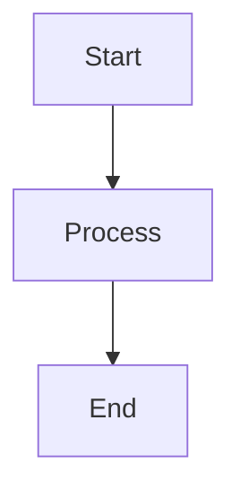

# Visual Assets

Guide for contributing visual assets to HSEOS documentation.

## Directory Structure

```
docs/assets/
├── banner.png                  (1983×793 — hero image, light mode)
├── banner-dark.png             (1983×793 — hero image, dark mode)
├── flow-overview.png           (1536×1024 — agent delivery flow)
├── architecture.png            (1536×1024 — system architecture)
├── getting-started-flow.png    (1536×1024 — onboarding flow)
├── demo.png                    (800×500  — demo stub, replace with GIF)
└── screenshots/
    ├── agent-activation.png    (1280×800 — agent activation example)
    └── skills-registry.png     (1280×800 — skills registry view)
```

## Specifications

| Type | Dimensions | Format | Max size |
|------|-----------|--------|---------|
| Banner | 1983×793 | PNG | 500 KB |
| Diagram | 1536×1024 | PNG | 300 KB |
| Screenshot | 1280×800 | PNG | 300 KB |
| Demo | 800×500 | GIF or PNG | 2 MB |

## Recommended Tools

- **Diagrams:** Excalidraw, draw.io, Mermaid (embed in `<details>` as text fallback)
- **Screenshots:** Carbon (code snippets), Ray.so, actual terminal captures
- **Banner:** Figma, Canva, Adobe Express
- **GIF recording:** Kap (macOS), ScreenToGif (Windows), peek (Linux)

## Accessibility Requirements

- Every `` **must** have a descriptive `alt` attribute
- Do not encode informational text as rasterized image text — use captions instead
- Consider contrast for both dark and light themes
- Use `<picture>` tag with `prefers-color-scheme` for banner variants

## Dark/Light Mode Pattern

```html
<p align="center">
  <picture>
    <source media="(prefers-color-scheme: dark)" srcset="docs/assets/banner-dark.png">
    
  </picture>
</p>
```

## Naming Convention

Use `kebab-case`, descriptive names:
- ✅ `agent-delivery-flow.png`
- ✅ `skills-registry-overview.png`
- ❌ `image1.png`, `screenshot.png`, `untitled.png`

## Mermaid Fallback Pattern

Every PNG diagram **must** have a Mermaid text fallback:

```markdown
<p align="center">
  
</p>

<details>
<summary>View diagram as text (Mermaid)</summary>



</details>
```

## Replacing Placeholders

Current placeholder images were generated programmatically. To replace with real assets:
1. Create the replacement image at the exact dimensions above
2. Export as PNG (or GIF for demos)
3. Keep the same filename
4. Verify size is under the maximum

All placeholders have a light gray or dark background with centered label text.
